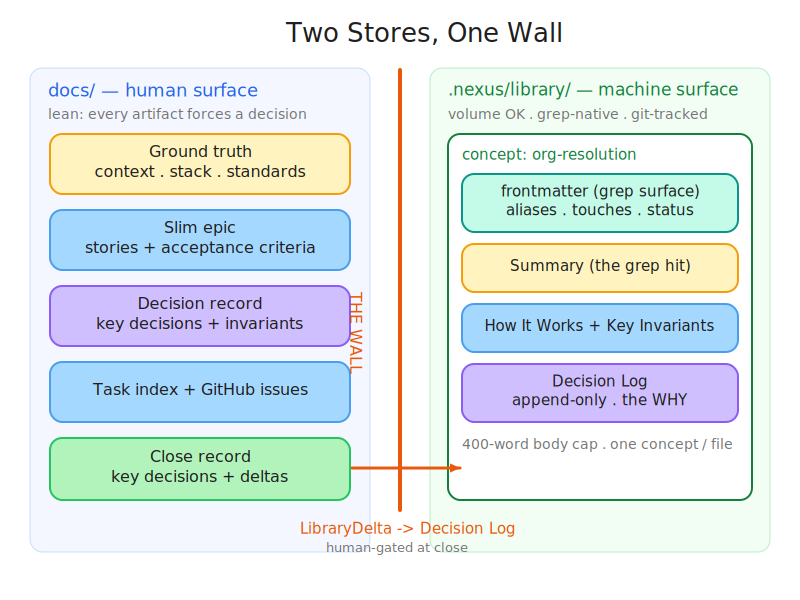
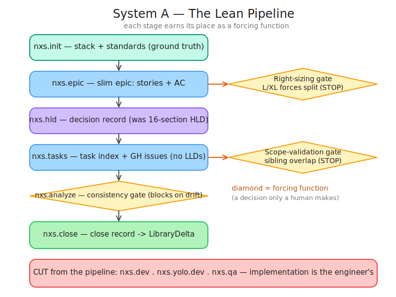
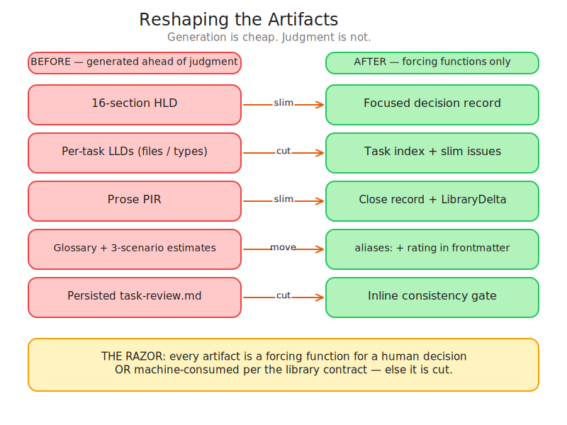
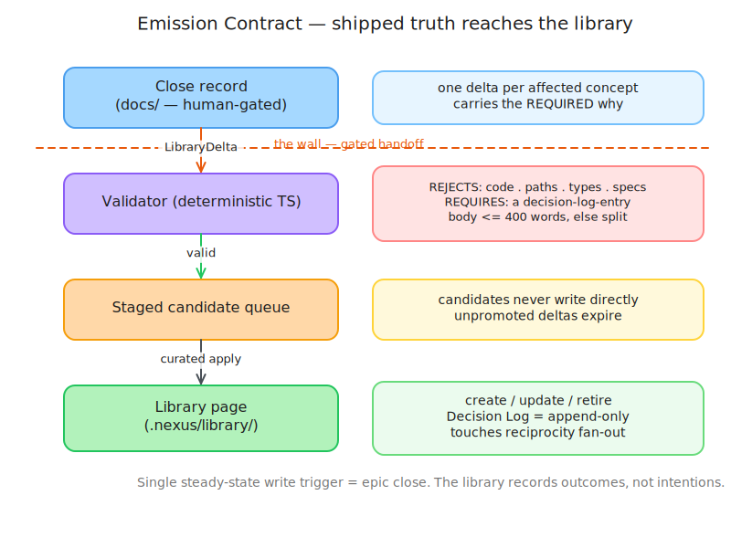
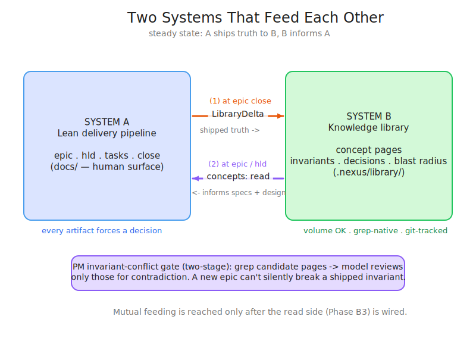
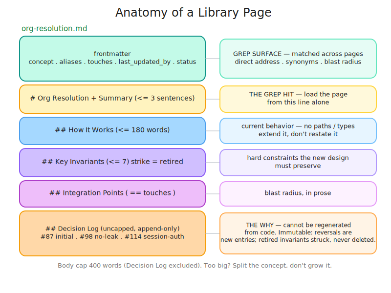

# How Nexus Works — A Visual Guide

> For visual thinkers. Every section leads with a diagram; the prose only explains it.
>
> This describes the **refactored** Nexus (the lean direction). It reflects the decisions
> frozen in [`.nexus/decisions/`](../.nexus/decisions/): the refactor direction (0001), the
> pipeline audit (0002), the library schema (0003), the implementation plan (0004), and the
> transient artifact storage model (0005).
>
> Diagrams are committed as self-contained `.excalidraw.svg` files in [`docs/diagrams/`](diagrams/)
> (open them in the Excalidraw VS Code plugin to edit; browsers render them as SVG inline below).

---

## The one idea

**Generation is cheap. Judgment is not.**

AI agents generate artifacts faster than humans can judge them. Left alone, a spec-driven
pipeline drowns its own purpose in volume — 16-section design docs, per-task low-level
designs, prose post-mortems, all produced _ahead of_ validated scope. Nexus exists to inject
human judgment at the right moments, so understanding **compounds** instead of decaying.

The refactor splits Nexus into **two systems that feed each other**:

- **System A** — a _lean delivery pipeline_ that assists Product and Project management. It
  produces only artifacts that force a human decision. Implementation is left to engineers.
- **System B** — a _knowledge library_ distilled from what System A ships. It informs the
  next round of specs and designs.

---

## 1. Two stores, one wall



Nexus keeps three physically separate surfaces:

| Surface | Committed? | Audience | Rule |
| --- | --- | --- | --- |
| [`docs/`](.) | Yes | **Humans** | Permanent only. Feature briefs, stack, standards, product context, council decisions. |
| [`.nexus/temp/`](../.nexus/temp/) | No (gitignored) | **Humans** (pipeline workspace) | Transient. Epic, decision record, task index, close record. Deleted by `/nxs.close`. |
| [`.nexus/library/`](../.nexus/library/) | Yes | **Machines** (AI tooling) | Volume is legitimate. Distilled, retrievable knowledge. |

The **wall** sits between the two committed stores. A command that writes human prose into
the library — or an ungated machine blob into `docs/` — is a review violation, not a style
nit. The only thing that crosses the wall is a **`LibraryDelta`**, and only _after_ a human
has gated it at the close review (see §4).

Transient pipeline artifacts never enter `docs/` or the library. They live in
`.nexus/temp/<branch>/<local-id>/` for the lifetime of the epic and leave no trace in the
committed tree once `/nxs.close` runs.

> Source: 0001 Decision 1, 0005. Diagram: [01-two-stores.excalidraw.svg](diagrams/01-two-stores.excalidraw.svg)

---

## 2. The lean pipeline (System A)



Each stage survives only because it forces a decision a human has to make. The **diamonds**
are forcing functions — hard stops where the pipeline waits for a person:

- **`nxs.init`** — establishes ground truth (stack, standards). Human-maintained.
- **`nxs.epic`** — a slim epic: user stories + acceptance criteria. Each story carries
  `story_type: user` (behavioral AC, observable by an end-user) or `system` (measurable
  technical AC — metric, threshold, contract assertion). The **right-sizing gate** forces
  L/XL epics to be split before any design happens — the early over-generation brake.
- **`nxs.hld`** — emits a _focused decision record_, not a 16-section HLD (see §3).
- **`nxs.tasks`** — a _task index_ + slim GitHub issues. No per-task LLDs. Each task carries
  a required `story_ref` linking it to the story it delivers — no orphaned technical tasks.
  The **scope-validation gate** catches overlap with sibling epics.
- **`nxs.analyze`** — an inline consistency gate that _blocks_ issue creation on drift.
  Story-traceability rules: every task has a `story_ref`; every story has at least one task;
  `user` stories require at least one task with a behavioral AC; `system` stories require at
  least one task with a measurable criterion (prose-only ACs are a gate failure).
- **`nxs.close`** — emits the close record and the `LibraryDelta` (see §4).

**Cut entirely:** `nxs.dev`, `nxs.yolo.dev`, and all three `nxs.qa` modes. Implementation and
its testing are the engineer's domain — Nexus is a judgment harness, not a code generator.

**Where pipeline artifacts live:** epic, decision record, task index, and close record are
written to `.nexus/temp/<branch>/<local-id>/` — gitignored, never committed. The `local-id`
is a random key generated at `/nxs.epic` time; commands discover it via
`git branch --show-current` + a glob over `.nexus/temp/<branch>/`. `/nxs.close` deletes the
folder as its final step.

> Source: 0002 §1–10, 0004 Phase A1, 0005. Diagram: [02-pipeline.excalidraw.svg](diagrams/02-pipeline.excalidraw.svg)

---

## 3. Reshaping the artifacts



The refactor's core move is replacing heavy, speculative artifacts with lean forcing
functions. Each "before" was generated ahead of validated need; each "after" earns its place:

- **16-section HLD → focused decision record** — keeps the chosen approach, key decisions +
  rationale, constraints/invariants, blocker risks, open clarifications. Everything else cut.
- **Per-task LLDs → task index** — file lists and type signatures rot against source and are
  the engineer's call; the index keeps summary + acceptance criteria + `story_ref` +
  dependencies.
- **Prose PIR → close record** — structured key decisions + per-concept deltas, not narrative.
- **Glossary / 3-scenario estimates → frontmatter** — canonical terms become page `aliases:`;
  the rating lands in frontmatter. Speculative estimate tables are cut.
- **Persisted `task-review.md` → inline gate** — the _check_ survives as a forcing function;
  the regenerable file does not.

**The razor:** every artifact is a forcing function for a human decision **or** machine-consumed
per the library contract — else it is cut.

> Source: 0001 (mineable conclusions), 0002. Diagram: [03-artifact-reshape.excalidraw.svg](diagrams/03-artifact-reshape.excalidraw.svg)

---

## 4. How knowledge crosses the wall (the emission contract)



The library records **shipped truth**, so it is written at exactly one steady-state moment:
**epic close**. The flow:

1. **Close record** (in `.nexus/temp/`, human-gated at the close review) carries a
   per-concept `LibraryDelta` block — one delta per affected concept, each with a _required_
   rationale (the "why").
2. A **deterministic validator** rejects anything the library must never hold (code, file
   paths, type names, API specs, speculative claims), requires a decision-log entry, and
   enforces the 400-word body cap.
3. Valid deltas are written to **`.nexus/staged/<local-id>.json`** — committed to the feature
   branch, travels to main with the PR. Candidates never write the library directly, and
   unpromoted deltas expire.
4. A **curated apply** step writes the **library page**: `create` / `update` / `retire`, with
   an append-only Decision Log and reciprocal `touches:` fan-out.

The handoff is safe _only_ because the human gates the deltas at the close review before they
cross the wall. Apply is always a curated step — never automatic. The temp folder is deleted
after the staged delta is written and the GH comment is posted.

> Source: 0003 §8, 0004 Phases A1/B0/B1, 0005. Diagram: [04-emission-contract.excalidraw.svg](diagrams/04-emission-contract.excalidraw.svg)

---

## 5. The two systems feed each other



The steady state is a loop:

- **(1) At epic close**, System A emits `LibraryDelta`s — System B records what actually
  shipped.
- **(2) At epic / HLD time**, System A _reads_ the library: a `concepts:` reading list loads
  the relevant pages (grep is the fallback), so a new spec extends what exists instead of
  restating it.

The read side includes a **two-stage invariant-conflict gate**: a cheap grep finds candidate
pages whose invariants a new epic might touch, then a model reviews _only those_ for
contradiction. A new epic cannot silently break a constraint the system already shipped.

Mutual feeding is a _steady-state property_, reached only once the read side (Phase B3) is
wired — not a build-order requirement. System A is fully usable standalone before then.

> Source: 0001 (the goal), 0004 Phase B3. Diagram: [05-feedback-loop.excalidraw.svg](diagrams/05-feedback-loop.excalidraw.svg)

---

## 6. Anatomy of a library page



One concept per file. The page is the unit of retrieval; the frontmatter is the grep surface;
the body is loaded only after a grep hit decides the page is worth reading.

- **Frontmatter** — `concept`, `aliases`, `touches`, `last_updated_by`, `status`. This is what
  cross-page greps match: direct addressing, synonym findability, and blast radius.
- **Summary** — the grep hit. An agent decides whether to load the whole page from this line
  alone, so it must read well returned by itself.
- **How It Works** (≤180 words) — current behavior in domain terms; no paths or type names
  (those rot; code is their source of truth).
- **Key Invariants** (≤7) — hard constraints the new design must preserve. Retired ones are
  struck through, never deleted.
- **Integration Points** — blast radius in prose; the set equals `touches:`.
- **Decision Log** (uncapped, **append-only**) — the _why_. This is the one thing that cannot
  be regenerated from code, which is why the library is git-tracked rather than derived.
  Reversals are new entries; nothing is ever rewritten.

Body cap is 400 words (Decision Log excluded). If a page exceeds it, the concept is too broad —
**split it, don't grow it**.

> Source: 0003 §2–6. Diagram: [06-page-anatomy.excalidraw.svg](diagrams/06-page-anatomy.excalidraw.svg)

---

## Where the build is

The interface between A and B is frozen first; then A is reshaped; then B is built against the
stable contract (0004):

```
Contract frozen (0002 + 0003)  ✔ done
  → A0  format specs        templates for decision-record / task-index / close-record
  → A1  System A reshape    rewrite commands, agents, skills; delete dev/qa
  → A2  pilot on one epic   gates entry to B
  → B0  distiller design
  → B1  distiller build     deterministic validator + staged queue + curated apply
  → B2  bootstrap           seed a repo's history in bulk
  → B3  read side           concepts: load + invariant-conflict gate (closes the loop)
  → C   rollout + institutionalize the razor as a recurring audit
```

## What Nexus deliberately does not do

- No Graphify, embeddings, RAG, or code-graph topology — blast radius is answered by `grep`
  over `touches:`, not a graph engine.
- No `nxs.dev` / `nxs.qa` — implementation is the engineer's.
- No generated index file for the library — `glob` + `grep` over frontmatter _is_ the index.
- No speculative timelines or three-scenario estimate tables — that pattern is what the
  refactor removes.
