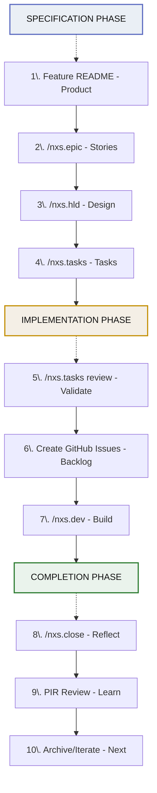

# Nexus Documentation

**Nexus** is a Spec Driven Development toolkit for AI Agents that enforces intentional friction before code generation. Think before you code. Design before you build. Document before you implement.

## Quick Navigation

### Getting Started

- [Installation](getting-started/installation.md) - Set up Nexus for Claude Code or Gemini
- [Project Setup](getting-started/setup.md) - Initialize your project structure
- [Your First Epic](getting-started/first-epic.md) - Complete walkthrough from idea to implementation

### Commands Reference

| Command                                 | Purpose                                         | Prerequisites           |
| --------------------------------------- | ----------------------------------------------- | ----------------------- |
| [/nxs.init](commands/nxs-init.md)       | Bootstrap project documentation structure       | None                    |
| [/nxs.epic](commands/nxs-epic.md)       | Create product specification with user stories  | Feature README.md       |
| [/nxs.hld](commands/nxs-hld.md)         | Generate high-level technical design            | epic.md                 |
| [/nxs.tasks](commands/nxs-tasks.md)     | Decompose HLD into implementation tasks (supports resume mode) | HLD.md or task-review.md |
| [/nxs.dev](commands/nxs-dev.md)         | Implement GitHub issue with test-first workflow | GitHub issue            |
| [/nxs.analyze](commands/nxs-analyze.md) | Validate epic/HLD/task consistency (supports --remediate) | epic.md, HLD.md, tasks/ |
| [/nxs.close](commands/nxs-close.md)     | Generate post-implementation review             | epic.md with link       |
| [/nxs.council](commands/nxs-council.md) | Multi-perspective epic review                   | epic.md                 |

### Workflow Guides

- [Specification-First Philosophy](workflow/specification-first.md) - Why think before coding
- [Epic to Implementation Flow](workflow/epic-to-implementation.md) - Complete development lifecycle
- [Git Workflows](workflow/git-workflows.md) - Worktrees, branching, environment syncing

### Core Concepts

- [Epics & User Stories](concepts/epics-and-stories.md) - Product specification structure
- [High-Level Design](concepts/high-level-design.md) - 16-section technical architecture
- [Task Decomposition](concepts/task-decomposition.md) - Breaking work into implementable chunks
- [Git Worktrees](concepts/worktrees.md) - Isolated development environments

### Configuration

- [Project Structure](configuration/project-structure.md) - Required folders and naming conventions
- [Required Files](configuration/required-files.md) - Essential configuration and templates
- [Customization](configuration/customization.md) - Tailoring Nexus to your project

### Reference

**Agents** - Specialized AI agents powering Nexus commands:
- **nxs-decomposer**: Work breakdown and estimation specialist. Transforms HLDs into tasks, assesses epic complexity (S/M/L/XL), sequences dependencies.
- **nxs-architect**: Technical architecture expert. Generates LLDs, validates standards conformance, provides design guidance.
- **nxs-analyzer**: Consistency and completeness validator. Detects coverage gaps, identifies superfluous tasks, auto-remediates common issues.

**Skills** - Reusable automation components (e.g., `nxs-gh-create-task`, `nxs-env-sync`, `nxs-workspace-setup`)

**Templates** - Document structure in `docs/system/delivery/` (task-template.md, task-labels.md)

## The Nexus Workflow



## Philosophy

Nexus is built on the principle that **clarity precedes code**. By forcing specification and design before implementation, it:

- **Reduces wasted effort** - Catching design issues before coding
- **Improves quality** - Comprehensive planning leads to better architecture
- **Enables collaboration** - Shared specifications align teams
- **Facilitates review** - Clear artifacts make feedback meaningful
- **Preserves context** - Documentation survives code churn

For a deeper dive into the philosophy, see the main [README](../README.md).

## Quick Start

1. **Install**: Copy the "update script" to your project root, then run it.
2. **Initialize**: Run `/nxs.init` in your project
3. **Create Feature**: Write a Feature README with frontmatter
4. **Specify**: Run `/nxs.epic` to create user stories
5. **Design**: Run `/nxs.hld` to generate technical design
6. **Decompose**: Run `/nxs.tasks` to create implementation plan
7. **Build**: Use `/nxs.dev <issue-number>` to implement tasks

For detailed walkthroughs, see [Getting Started](getting-started/installation.md).

## Support

- **Claude Code**: Fully supported (primary platform)
- **Gemini**: Partial support (experimental)

## Project Structure

Nexus expects this documentation structure:

```
project/
├── docs/
│   ├── product/
│   │   ├── context.md
│   │   └── features/
│   │       └── {EPIC}/
│   │           ├── README.md (Feature specification)
│   │           ├── epic.md (Generated user stories)
│   │           ├── HLD.md (Generated design)
│   │           ├── tasks.md (Task summary with dependency graph)
│   │           └── tasks/
│   │               ├── TASK-{EPIC}.01.md
│   │               ├── TASK-{EPIC}.02.md
│   │               ├── task-review.md (Consistency analysis)
│   │               └── .scratchpad/ (Intermediate data for debugging)
│   └── system/
│       ├── stack.md
│       ├── standards/
│       │   ├── coding-standards.md
│       │   └── ...
│       └── delivery/
│           ├── config.json
│           ├── task-labels.md
│           └── task-template.md
└── CLAUDE.md (Project context for AI)
```

See [Project Structure](configuration/project-structure.md) for details.

## Common Questions

**Q: Why not just start coding?**
A: Nexus is for complex features where upfront design saves time. For simple changes, skip the ceremony.

**Q: Can I use Nexus without GitHub?**
A: The task generation works without GitHub, but `/nxs.dev` requires GitHub issues for orchestration.

**Q: How do I customize task templates?**
A: Edit `docs/system/delivery/task-template.md` to modify the structure of generated tasks.

**Q: What if my epic is too large?**
A: `/nxs.epic` includes automatic right-sizing analysis and will offer to decompose oversized epics.

**Q: Can I skip steps?**
A: You can, but each step builds on the previous. Skipping epic → HLD means the architect has less context.

## Contributing

For contribution guidelines and architecture decisions, see the main repository documentation.

## License

See the main repository for license information.
